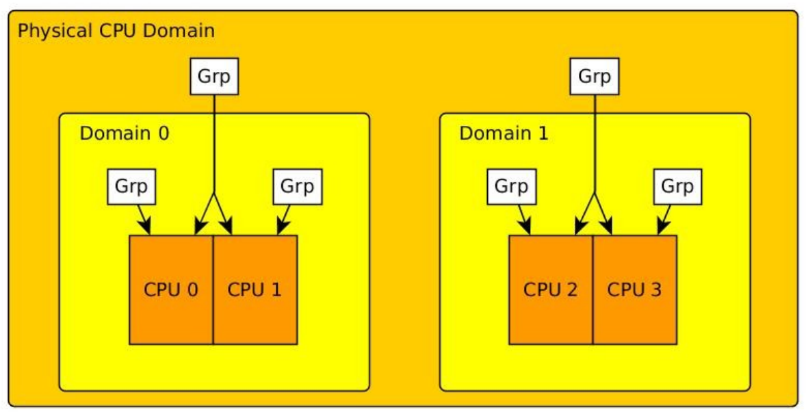

# 10. Load Balancing on SMP Systems

Load balancing was introduced with the main goal of improving the performance of SMP systems by offloading tasks from busy CPUs to less busy or idle ones. The Linux scheduler checks regularly how the task load is spread throughout the system and performs load balancing if necessary.

The complexity lies in serving a variety of SMP system topologies. There are systems with multiple physical cores where tasks might suffer more from a cache flush due to being moved to a different CPU than from being scheduled on a more busy CPU. Other systems might support hyper threading with shared caches where this scenario is more flexible towards task migration due to shared caches. NUMA architectures create situations where different nodes have different access speeds to different areas of main memory.

In order to tackle this topology variety, scheduling domains were introduced in the 2.6 Linux kernel. They are a way of hierarchically grouping all available CPUs in the system which gives the kernel a way of characterising the underlying core topology.

## 10.1. Scheduling Domains and Groups

A scheduling domain is a set of CPUs which share properties and scheduling policies, and which can be balanced against each other.

Each domain can contain one ore more scheduling groups which are treated as a single unit by the domain. When the scheduler tries to balance the load within a domain, it tries to even out the load carried by each scheduling group without worrying directly about what is happening within the group.



Imagine a system with two physical CPUs which are both hyperthreaded which gives us in total four logical CPUs. If the system starts up, the kernel would divide the logical cores into the two level domain hierarchy you can see in the picture.

Each hyperthreaded processor is put into exactly one group while either two are in a single domain.These two domains are then again put into a top level domain which holds the complete processor.

It contains two groups which both have two hyperthreaded cores each.

If this were a NUMA system, it would have multiple domains which look like the above diagram;each of those domains would represent one NUMA node. The hierarchy would have a third, systemlevel domain which contains all of the NUMA nodes.

## 10.2 Load Balancing

Each scheduling domain has a balancing policy set which is valid on that level of the hierarchy. The policy parameters include how often attempts should be made to balance loads across the domain, how far the loads on the component processors are allowed to get out of sync before a balancing attempt is made, how long a process can sit idle before it is considered to no longer have any significant cache affinity.

On top of that, various policy flags specify the behaviour for certain situations, such as: A CPU goes idle; should the balancing code look for a task to pull? A task wakes up or is spawned; which CPU should it be scheduled on?

An active load balancing is executed regularly which moves up the scheduling domain hierarchy and checks all groups along the way if they got out of balance. If so it does a balancing attempt considering the policy rules of the corresponding domain.

## 10.3 Implementation Details

### Data Structures

Two data structures were added to include/linux/sched.h to divide the cores into a balancing hierarchy. sched_domain represents a scheduling domain and sched_group a scheduling group:

```
struct sched_domain {
    /* These fields must be setup */
    struct sched_domain *parent; /* top domain must be null terminated */
    struct sched_domain *child; /* bottom domain must be null terminated */
    struct sched_group *groups; /* the balancing groups of the domain */
    unsigned long min_interval; /* Minimum balance interval ms */
    unsigned long max_interval; /* Maximum balance interval ms */
    unsigned int busy_factor; /* less balancing by factor if busy */
    unsigned int imbalance_pct; /* No balance until over watermark */
    unsigned int cache_nice_tries; /* Leave cache hot tasks for # tries */
    unsigned int busy_idx;
    unsigned int idle_idx;
    unsigned int newidle_idx;
    unsigned int wake_idx;
    unsigned int forkexec_idx;
    unsigned int smt_gain;
    int flags; /* See SD_* */
    int level;
    /* Runtime fields. */
    unsigned long last_balance; /* init to jiffies. units in jiffies */
    unsigned int balance_interval; /* initialise to 1. units in ms. */
    unsigned int nr_balance_failed; /* initialise to 0 */
    u64 last_update;
    ...
    unsigned int span_weight;
    /*
    * Span of all CPUs in this domain.
    *
    * NOTE: this field is variable length. (Allocated dynamically
    * by attaching extra space to the end of the structure,
    * depending on how many CPUs the kernel has booted up with)
    */
    unsigned long span[0];
};
struct sched_group {
    struct sched_group *next; /* Must be a circular list */
    atomic_t ref;
    unsigned int group_weight;
    struct sched_group_power *sgp;
    /*
    * The CPUs this group covers.
    *
    * NOTE: this field is variable length. (Allocated dynamically
    * by attaching extra space to the end of the structure,
    * depending on how many CPUs the kernel has booted up with)
    */
    unsigned long cpumask[0];
};
```

In include/linux/topology.h or the corresponding architecture version, you can see how flags and values for the scheduling domain policy are set.

In sched_group you can see a field called sgp which is of the type sched_group_power. The concept of total CPU power of a group was introduced to further specify the topology of a processor. Even though a hyperthreaded core appears as an independent unit, it has in reality significantly less processing power than a second physical core. Two separate processors would have a CPU power of two, while a hyperthreaded pair would have something closer to 1.1. During load balancing, the kernel tries to maximise the CPU power value to increase the overall throughput of the system.

### Active Balancing

Active balancing is performed regularly on each CPU. During active balancing, the kernel walks up the domain hierarchy, starting at the current CPU's domain, and checks each scheduling domain to see if it is due to be balanced, and initiates a balancing operation if so.

During scheduler initialisation, a soft irq handler is registered which performs the regular load balancing. It is triggered in scheduler_tick() with a call to trigger_load_balance() (see Scheduler Skeleton). trigger_load_balance() checks a timer and if balancing is due, it fires the soft irq with the corresponding flag SCHED_SOFTIRQ.

```
/*
* Trigger the SCHED_SOFTIRQ if it is time to do periodic load balancing.
*/
static inline void trigger_load_balance(struct rq *rq, int cpu)
{
    /* Don't need to rebalance while attached to NULL domain */
    if (time_after_eq(jiffies, rq->next_balance) &&
        likely(!on_null_domain(cpu)))
        raise_softirq(SCHED_SOFTIRQ);
#ifdef CONFIG_NO_HZ
    else if (nohz_kick_needed(rq, cpu) && likely(!on_null_domain(cpu)))
        nohz_balancer_kick(cpu);
#endif
}
```

The function registered as irq handler is run_rebalance_domains() which calls rebalance_domains() to perform the actual work.

```
/*
* run_rebalance_domains is triggered when needed from the scheduler tick.
* Also triggered for nohz idle balancing (with nohz_balancing_kick set).
*/
static void run_rebalance_domains(struct softirq_action *h)
{
    int this_cpu = smp_processor_id();
    struct rq *this_rq = cpu_rq(this_cpu);
    enum cpu_idle_type idle = this_rq->idle_at_tick ?
                              CPU_IDLE : CPU_NOT_IDLE;
    rebalance_domains(this_cpu, idle);
    /*
    * If this cpu has a pending nohz_balance_kick, then do the
    * balancing on behalf of the other idle cpus whose ticks are
    * stopped.
    */
    nohz_idle_balance(this_cpu, idle);
}
```

rebalance_domains() then walks up the domain hierarchy and calls load_balance() if the domain has the SD_LOAD_BALANCE flag set and its balancing interval is expired. The balancing interval of a domain is in jiffies and updated after each balancing run.

Note that active balancing is a pull operation for the executing CPU. It would pull a task from an overloaded CPU to the current one to rebalance tasks but it would not push one of. The function executing this pull operation is load_balance(). If it is able to find an imbalanced group, it moves one or more tasks over to the current CPU and returns a value larger than 0.

```
/*
 * It checks each scheduling domain to see if it is due to be balanced,
 * and initiates a balancing operation if so.
 *
 * Balancing parameters are set up in arch_init_sched_domains.
 */
static void rebalance_domains(int cpu, enum cpu_idle_type idle)
{
    int balance = 1;
    struct rq *rq = cpu_rq(cpu);
    unsigned long interval;
    struct sched_domain *sd;
    /* Earliest time when we have to do rebalance again */
    unsigned long next_balance = jiffies + 60*HZ;
    int update_next_balance = 0;
    int need_serialize;
    update_shares(cpu);
    rcu_read_lock();
    for_each_domain(cpu, sd) {
        if (!(sd->flags & SD_LOAD_BALANCE))
            continue;
        interval = sd->balance_interval;
        if (idle != CPU_IDLE)
            interval *= sd->busy_factor;
        /* scale ms to jiffies */
        interval = msecs_to_jiffies(interval);
        interval = clamp(interval, 1UL, max_load_balance_interval);
        need_serialize = sd->flags & SD_SERIALIZE;
        if (need_serialize) {
            if (!spin_trylock(&balancing))
                goto out;
        }
        if (time_after_eq(jiffies, sd->last_balance + interval)) {
            if (load_balance(cpu, rq, sd, idle, &balance)) {
                /*
                 * We've pulled tasks over so either we're no
                 * longer idle.
                 */
                idle = CPU_NOT_IDLE;
            }
            sd->last_balance = jiffies;
        }
        if (need_serialize)
            spin_unlock(&balancing);
out:
        if (time_after(next_balance, sd->last_balance + interval)) {
            next_balance = sd->last_balance + interval;
            update_next_balance = 1;
        }
        /*
         * Stop the load balance at this level. There is another
         * CPU in our sched group which is doing load balancing more
         * actively.
         */
        if (!balance)
            break;
    }
    rcu_read_unlock();
    /*
     * next_balance will be updated only when there is a need.
     * When the cpu is attached to null domain for ex, it will not be
     * updated.
     */
    if (likely(update_next_balance))
        rq->next_balance = next_balance;
}
```

load_balance() calls find_busiest_group() which looks for an imbalance in the given sched_domain and returns the busiest group if it finds one. If the system is in balance and no group is found, load_balance() returns.

If a group was returned, it is passed on to find_busiest_queue() which returns the runqueue of the busiest logical CPU in that group.

load_balance() then searches the resulting runqueue for tasks to swap over to the current CPU's queue by calling move_tasks(). The imbalance parameter, which was set in find_busiest_group(), specifies the amount of tasks that should be moved. It can happen that all tasks on the queue are pinned to it due to cache affinity. In that case, load_balance() searches again but excludes the previously found CPU.

```
/*
 * Check this_cpu to ensure it is balanced within domain. Attempt to move
 * tasks if there is an imbalance.
 */
static int load_balance(int this_cpu, struct rq *this_rq,
                        struct sched_domain *sd, enum cpu_idle_type idle,
                        int *balance)
{
    int ld_moved, all_pinned = 0, active_balance = 0;
    struct sched_group *group;
    unsigned long imbalance;
    struct rq *busiest;
    unsigned long flags;
    struct cpumask *cpus = __get_cpu_var(load_balance_tmpmask);
    cpumask_copy(cpus, cpu_active_mask);
    schedstat_inc(sd, lb_count[idle]);
redo:
    group = find_busiest_group(sd, this_cpu, &imbalance, idle,
                               cpus, balance);
    if (*balance == 0)
        goto out_balanced;
    if (!group) {
        schedstat_inc(sd, lb_nobusyg[idle]);
        goto out_balanced;
    }
    busiest = find_busiest_queue(sd, group, idle, imbalance, cpus);
    if (!busiest) {
        schedstat_inc(sd, lb_nobusyq[idle]);
        goto out_balanced;
    }
    BUG_ON(busiest == this_rq);
    schedstat_add(sd, lb_imbalance[idle], imbalance);
    ld_moved = 0;
    if (busiest->nr_running > 1) {
        /*
         * Attempt to move tasks. If find_busiest_group has found
         * an imbalance but busiest->nr_running <= 1, the group is
         * still unbalanced. ld_moved simply stays zero, so it is
         * correctly treated as an imbalance.
         */
        all_pinned = 1;
        local_irq_save(flags);
        double_rq_lock(this_rq, busiest);
        ld_moved = move_tasks(this_rq, this_cpu, busiest,
                              imbalance, sd, idle, &all_pinned);
        double_rq_unlock(this_rq, busiest);
        local_irq_restore(flags);
        /*
         * some other cpu did the load balance for us.
         */
        if (ld_moved && this_cpu != smp_processor_id())
            resched_cpu(this_cpu);
        /* All tasks on this runqueue were pinned by CPU affinity */
        if (unlikely(all_pinned)) {
            cpumask_clear_cpu(cpu_of(busiest), cpus);
            if (!cpumask_empty(cpus))
                goto redo;
            goto out_balanced;
        }
    }
    ...
    goto out;
out_balanced:
    schedstat_inc(sd, lb_balanced[idle]);
    sd->nr_balance_failed = 0;
out_one_pinned:
    /* tune up the balancing interval */
    if ((all_pinned && sd->balance_interval < MAX_PINNED_INTERVAL) ||
        (sd->balance_interval < sd->max_interval))
        sd->balance_interval *= 2;
    ld_moved = 0;
out:
    return ld_moved;
}
```

An energy saving related tweak is hidden in find_busiest_group(). If the SD_POWERSAVINGS_BALANCE flag is set in the domains policy and no busiest group is found, find_busiest_group() would look for the least loaded group in the sched_domain, so that it's CPUs can be put to idle. This feature, however, is not activated in the Android kernel and removed from the Ubuntu one.

### Idle Balancing

Idle balancing is invoked as soon as a CPU goes idle. Therefore, it is called by schedule() for the CPU executing the current scheduling thread if its runqueue becomes empty (see Scheduler Sekeleton).

Like active balancing, idle_balance() is implemented in sched_fair.c. First, it checks if the average idle period of the idle runqueue is larger than the cost of migrating a task over to it, that means it checks if it is worth getting a task from somewhere else or if it is better to just wait since the next task is likely to wake up soon anyway.

If migrating a task makes sense, idle_balance() pretty much works like rebalance_domains(). It walks up the domain hierarchy and calls idle_balance() for domains that have the SD_LOAD_BALANCE and the idle balance specific SD_BALANCE_NEWIDLE flag set.

If one or more tasks were pulled over, the hierarchy walk is terminated and idle_balance() returns.

```
/*
 * idle_balance is called by schedule() if this_cpu is about to become
 * idle. Attempts to pull tasks from other CPUs.
 */
static void idle_balance(int this_cpu, struct rq *this_rq)
{
    struct sched_domain *sd;
    int pulled_task = 0;
    unsigned long next_balance = jiffies + HZ;
    this_rq->idle_stamp = this_rq->clock;
    if (this_rq->avg_idle < sysctl_sched_migration_cost)
        return;
    /*
     * Drop the rq->lock, but keep IRQ/preempt disabled.
     */
    raw_spin_unlock(&this_rq->lock);
    update_shares(this_cpu);
    rcu_read_lock();
    for_each_domain(this_cpu, sd) {
        unsigned long interval;
        int balance = 1;
        if (!(sd->flags & SD_LOAD_BALANCE))
            continue;
        if (sd->flags & SD_BALANCE_NEWIDLE) {
            /* If we've pulled tasks over stop searching: */
            pulled_task = load_balance(this_cpu, this_rq,
                                       sd, CPU_NEWLY_IDLE, &balance);
        }
        interval = msecs_to_jiffies(sd->balance_interval);
        if (time_after(next_balance, sd->last_balance + interval))
            next_balance = sd->last_balance + interval;
        if (pulled_task) {
            this_rq->idle_stamp = 0;
            break;
        }
    }
    rcu_read_unlock();
    raw_spin_lock(&this_rq->lock);
    if (pulled_task || time_after(jiffies, this_rq->next_balance)) {
        /*
         * We are going idle. next_balance may be set based on
         * a busy processor. So reset next_balance.
         */
        this_rq->next_balance = next_balance;
    }
}

```

### Selecting a runqueue for a new task

A third spot where balancing decisions need to be made is when a task wakes up or is created and needs to be placed on a runqueue. This runqueue should be selected considering the overall task balance of the system.

Each scheduling class implements its own strategy to handle their tasks and provides a hook (select_task_rq()) that can be called by the scheduler skeleton (kernel/sched.c) to execute it. It is called for three different occasions which are each marked by a corresponding domain flag.

- 1. SD_BALANCE_EXEC flag is used in sched_exec(). This function is called if a task starts a new one by using the exec() system call. A new task at this point has a small memory and cache footprint which gives the kernel a good balancing opportunity.
- 2. SD_BALANCE_FORK flag is used in wake_up_new_task(). This function is called if a newly created task is woken up for the first time.
- 3. SD_BALANCE_WAKE flag is used in try_to_wake_up(). If a task that was running before wakes up it usually has some kind of cache affinity which needs to be considered while selecting a good queue to schedule it on.

---

# 10. SMP 系统下的负载均衡

引入负载均衡的主要目的是通过将任务从负载重的处理器转移到负载轻的处理器上来提高整个 SMP 系统的性能。Linux 的任务调度器会周期性检查任务负载是如何扩散到整个系统，以及是否有必要执行负载均衡。

负载均衡的复杂之处在于要服务各种各样拓扑结构的 SMP 系统。有些多物理处理器核心的系统，要将任务调度到不同的 CPU 上要比在本身已经负载重的 CPU 上多忍受一次清洗缓存（cache）的操作。而对支持超线程的系统，因为是共享缓存的缘故，相同的场景下调度任务到不同的处理器更灵活。NUMA 家头创造了一个场景：不同的节点访问不同区域的主内存速度不同。

为了解决拓扑结构多样性的问题，在 2.6 版的 Linux 内核引入了调度域的概念。这种方案按层次结构将系统中所有可用的 CPU 分组，这就使得内核有了一种办法描述下层的处理器核心拓扑结构。

## 10.1. 调度域和调度组

一个调度域是一组共享调度属性和策略的 CPU，可以用来和其它域进行负载平衡。

每个域包含一个或多个调度组，每个组在域内都被视为一个单元，调度器会尝试使各个组的负载均等而不考虑组内到底发生了什么。


想象一个系统有两个物理处理器，每个都支持超线程这就给我们提供了 4 个逻辑处理器。如果系统启动了，内核会如图所示把逻辑核心分到两个调度域层级。

每个超线程处理器会被精确的放到一个组内而且每两个会到一个域内。这两个域然后回复被放到控制整个处理器的顶级域里。

整个系统包含两个组，每个组又有两个处理器核心。

如果是 NUMA 系统就会像上面图标所示的那样包含多个域；每个域代表一个 NUMA 节点。系统会分三级，系统级域会包含所有的 NUMA 节点。

## 10.2. 负载均衡

每个调度域都有一个只在本级有效均衡策略集。这个策略的参数包含每隔多长时间要尝试在整个域内进行一次负载均衡，how far the loads on the component processors are allowed to get out of sync before a balancing attempt is made，how long a process can sit idle before it is considered to no longer have any significant cache affinity.

最重要的是不同的的策略标志指定了特定情况下的调度行为，比如：一个 CPU 进入空闲；负载均衡应该给它提供一个任务吗？唤醒或创建一个任务；应该调度到那个 CPU 上执行？

系统会周期性的进行动态负载将调度域层级上移，按顺序检查所有的组是否失去均衡了。如果失去均衡则会尝试使用对应域的调度策略的规则执行一次负载均衡。

## 10.3. 实现细节

### 数据结构

`include/linux/sched.h` 添加了两个数据结构来将处理器核心分割到不同的负载均衡层级。`sched_domain` 代表一个调度域，`sched_group` 代表一个调度组：

```
struct sched_domain {
    /* These fields must be setup */
    struct sched_domain *parent; /* top domain must be null terminated */
    struct sched_domain *child; /* bottom domain must be null terminated */
    struct sched_group *groups; /* the balancing groups of the domain */
    unsigned long min_interval; /* Minimum balance interval ms */
    unsigned long max_interval; /* Maximum balance interval ms */
    unsigned int busy_factor; /* less balancing by factor if busy */
    unsigned int imbalance_pct; /* No balance until over watermark */
    unsigned int cache_nice_tries; /* Leave cache hot tasks for # tries */
    unsigned int busy_idx;
    unsigned int idle_idx;
    unsigned int newidle_idx;
    unsigned int wake_idx;
    unsigned int forkexec_idx;
    unsigned int smt_gain;
    int flags; /* See SD_* */
    int level;
    /* Runtime fields. */
    unsigned long last_balance; /* init to jiffies. units in jiffies */
    unsigned int balance_interval; /* initialise to 1. units in ms. */
    unsigned int nr_balance_failed; /* initialise to 0 */
    u64 last_update;
    ...
    unsigned int span_weight;
    /*
    * Span of all CPUs in this domain.
    *
    * NOTE: this field is variable length. (Allocated dynamically
    * by attaching extra space to the end of the structure,
    * depending on how many CPUs the kernel has booted up with)
    */
    unsigned long span[0];
};
struct sched_group {
    struct sched_group *next; /* Must be a circular list */
    atomic_t ref;
    unsigned int group_weight;
    struct sched_group_power *sgp;
    /*
    * The CPUs this group covers.
    *
    * NOTE: this field is variable length. (Allocated dynamically
    * by attaching extra space to the end of the structure,
    * depending on how many CPUs the kernel has booted up with)
    */
    unsigned long cpumask[0];
};
```

在 `include/linux/topology.h`或对应的处理器架构的代码中你可以看到如何为调度域的标志和值是如何设置的。

在 `sched_group` 中你会看到一个 `sched_group_power` 类型的 `sgp` 的字段。系统引入了全组 CPU power 的概念来指定处理器的拓扑结构。甚至一个超线程核心都被看作一个独立的单元，它实际上比另一个物理核心明显缺少很多处理器 power 。两个分开的处理器会有两个 CPU power 而一对超线程核心拥有接近 1.1 个 CPU power。在进行负载均衡的过程中，内核会尝试最大化 CPU power 的值来提高整个系统的吞吐量。

### 积极均衡

系统会周期性的在每个 CPU 上进行 Active balancing 。在 Active balancing 中，内核会唤起域层级，从当前 CPU 的域开始检查每个调度域是否需要进行均衡，是的话就需要执行一次均衡操作。

在调度器初始化的时候系统会注册一个软中断处理程序来定期的执行负载均衡。触发时机在 `scheduler_tick()` 调用 `trigger_load_balance()` （参见调度框架）时。`trigger_load_balance()` 会检查定时器，如果进行均衡的时间点到了则会通过对应的标志 `SCHED_SOFTIRQ` 启动这个软中断。

```
/*
* Trigger the SCHED_SOFTIRQ if it is time to do periodic load balancing.
*/
static inline void trigger_load_balance(struct rq *rq, int cpu)
{
    /* Don't need to rebalance while attached to NULL domain */
    if (time_after_eq(jiffies, rq->next_balance) &&
        likely(!on_null_domain(cpu)))
        raise_softirq(SCHED_SOFTIRQ);
#ifdef CONFIG_NO_HZ
    else if (nohz_kick_needed(rq, cpu) && likely(!on_null_domain(cpu)))
        nohz_balancer_kick(cpu);
#endif
}
```

这个被注册为终端处理程序的函数是 `run_rebalance_domains()` ， 他会调用 `rebalance_domains()` 进行实际工作。

```
/*
* run_rebalance_domains is triggered when needed from the scheduler tick.
* Also triggered for nohz idle balancing (with nohz_balancing_kick set).
*/
static void run_rebalance_domains(struct softirq_action *h)
{
    int this_cpu = smp_processor_id();
    struct rq *this_rq = cpu_rq(this_cpu);
    enum cpu_idle_type idle = this_rq->idle_at_tick ?
                              CPU_IDLE : CPU_NOT_IDLE;
    rebalance_domains(this_cpu, idle);
    /*
    * If this cpu has a pending nohz_balance_kick, then do the
    * balancing on behalf of the other idle cpus whose ticks are
    * stopped.
    */
    nohz_idle_balance(this_cpu, idle);
}
```

`rebalance_domains()` 之后会遍历整个域层级，然后如果这个域的标志 `SD_LOAD_BALANCE` 被设置了并且均衡间隔到期了就调用 `load_balance()` 。一个域的均衡间隔是以 jiffies 计算，每次执行均衡之后会更新。

注意，积极均衡对于执行它的 CPU 来说是一个拉取操作。他将或从一个过载的 CPU 上拉取一个任务到当前的处理器以此来重新让任务分配平衡，但是他不会吧自己的任务推送给其他处理器。执行这个拉取操作的函数是`load_balance()`。如果它可以找到一个不平衡的组，他也会移动一个或更多的任务到当前 CPU 并且返回一个比 0 大的值。

```
/*
 * It checks each scheduling domain to see if it is due to be balanced,
 * and initiates a balancing operation if so.
 *
 * Balancing parameters are set up in arch_init_sched_domains.
 */
static void rebalance_domains(int cpu, enum cpu_idle_type idle)
{
    int balance = 1;
    struct rq *rq = cpu_rq(cpu);
    unsigned long interval;
    struct sched_domain *sd;
    /* Earliest time when we have to do rebalance again */
    unsigned long next_balance = jiffies + 60*HZ;
    int update_next_balance = 0;
    int need_serialize;
    update_shares(cpu);
    rcu_read_lock();
    for_each_domain(cpu, sd) {
        if (!(sd->flags & SD_LOAD_BALANCE))
            continue;
        interval = sd->balance_interval;
        if (idle != CPU_IDLE)
            interval *= sd->busy_factor;
        /* scale ms to jiffies */
        interval = msecs_to_jiffies(interval);
        interval = clamp(interval, 1UL, max_load_balance_interval);
        need_serialize = sd->flags & SD_SERIALIZE;
        if (need_serialize) {
            if (!spin_trylock(&balancing))
                goto out;
        }
        if (time_after_eq(jiffies, sd->last_balance + interval)) {
            if (load_balance(cpu, rq, sd, idle, &balance)) {
                /*
                 * We've pulled tasks over so either we're no
                 * longer idle.
                 */
                idle = CPU_NOT_IDLE;
            }
            sd->last_balance = jiffies;
        }
        if (need_serialize)
            spin_unlock(&balancing);
out:
        if (time_after(next_balance, sd->last_balance + interval)) {
            next_balance = sd->last_balance + interval;
            update_next_balance = 1;
        }
        /*
         * Stop the load balance at this level. There is another
         * CPU in our sched group which is doing load balancing more
         * actively.
         */
        if (!balance)
            break;
    }
    rcu_read_unlock();
    /*
     * next_balance will be updated only when there is a need.
     * When the cpu is attached to null domain for ex, it will not be
     * updated.
     */
    if (likely(update_next_balance))
        rq->next_balance = next_balance;
}
```

`load_balance()` 调用 `find_busiest_group()` 来在给定的 `sched_domain`（调度域）寻找不均衡然后如果能找到最繁忙的组的话就返回这个组。如果系统处于均衡状态而且没有找到不均衡的组， `load_balance()` 返回。

如果返回了一个组，这个组就被传给 `find_busiest_queue()` 来寻找组中最忙的逻辑 CPU 的运行队列。

`load_balance()` 接着搜寻返回的运行队列，通过 `move_tasks()` 挑选一个要从当前 CPU 的队列移出的任务。在 `find_busiest_group()` 中设置的不均衡参数指定了要移出的任务的数量。可能会发生这样的情况：因为缓存亲和力的缘故队列中的全部任务都被固定了。这种情况下 `load_balance()` 会再次搜索但是会排除之前找到的 CPU 。

```
/*
 * Check this_cpu to ensure it is balanced within domain. Attempt to move
 * tasks if there is an imbalance.
 */
static int load_balance(int this_cpu, struct rq *this_rq,
                        struct sched_domain *sd, enum cpu_idle_type idle,
                        int *balance)
{
    int ld_moved, all_pinned = 0, active_balance = 0;
    struct sched_group *group;
    unsigned long imbalance;
    struct rq *busiest;
    unsigned long flags;
    struct cpumask *cpus = __get_cpu_var(load_balance_tmpmask);
    cpumask_copy(cpus, cpu_active_mask);
    schedstat_inc(sd, lb_count[idle]);
redo:
    group = find_busiest_group(sd, this_cpu, &imbalance, idle,
                               cpus, balance);
    if (*balance == 0)
        goto out_balanced;
    if (!group) {
        schedstat_inc(sd, lb_nobusyg[idle]);
        goto out_balanced;
    }
    busiest = find_busiest_queue(sd, group, idle, imbalance, cpus);
    if (!busiest) {
        schedstat_inc(sd, lb_nobusyq[idle]);
        goto out_balanced;
    }
    BUG_ON(busiest == this_rq);
    schedstat_add(sd, lb_imbalance[idle], imbalance);
    ld_moved = 0;
    if (busiest->nr_running > 1) {
        /*
         * Attempt to move tasks. If find_busiest_group has found
         * an imbalance but busiest->nr_running <= 1, the group is
         * still unbalanced. ld_moved simply stays zero, so it is
         * correctly treated as an imbalance.
         */
        all_pinned = 1;
        local_irq_save(flags);
        double_rq_lock(this_rq, busiest);
        ld_moved = move_tasks(this_rq, this_cpu, busiest,
                              imbalance, sd, idle, &all_pinned);
        double_rq_unlock(this_rq, busiest);
        local_irq_restore(flags);
        /*
         * some other cpu did the load balance for us.
         */
        if (ld_moved && this_cpu != smp_processor_id())
            resched_cpu(this_cpu);
        /* All tasks on this runqueue were pinned by CPU affinity */
        if (unlikely(all_pinned)) {
            cpumask_clear_cpu(cpu_of(busiest), cpus);
            if (!cpumask_empty(cpus))
                goto redo;
            goto out_balanced;
        }
    }
    ...
    goto out;
out_balanced:
    schedstat_inc(sd, lb_balanced[idle]);
    sd->nr_balance_failed = 0;
out_one_pinned:
    /* tune up the balancing interval */
    if ((all_pinned && sd->balance_interval < MAX_PINNED_INTERVAL) ||
        (sd->balance_interval < sd->max_interval))
        sd->balance_interval *= 2;
    ld_moved = 0;
out:
    return ld_moved;
}
```

一个和节省能源相关的方法隐藏在函数 `find_busiest_group()` 中。如果设置了域策略的 `SD_POWERSAVINGS_BALANCE` 标志，而且没有找到最繁忙的组，则 `find_busiest_group()` 会寻找调度域中负载最低的组，所以这个处理器就可以进入空闲模式了。而在 Android 使用的内核中这个特性并没有激活，而且 Ubuntu 也取消了这个功能。

### 空闲平衡

一旦 CPU 进入空闲模式就会执行空闲平衡操作。因此如果运行队列变空（参见调度框架），则执行当前调度线程的 CPU 会在 `schedule()` 中执行空闲平衡操作。

和积极平衡类似， `idle_balance()` 的实现位于 `sched_fair.c` 中。首先，他会检查空闲的运行队列的平均空闲时间是否比将任务迁移过去还要长，这实际上就是说系统会检查是否值得迁移任务或者仅仅保持现状就好了，因为下一个任务很快就会被唤醒了。

如果前一任务起作用，`idle_balance()` 的功能更类似 `rebalance_domains()` 。它会遍历域层级然后调用在设置了标志 SD_LOAD_BALANCE 和 SD_BALANCE_NEWIDLE 的域中执行 `idle_balance()` 。一个域的均衡间隔是以

如果一个或多个任务被拉过来，则遍历层级会终止然后 `idle_balance()` 返回。

```
/*
 * idle_balance is called by schedule() if this_cpu is about to become
 * idle. Attempts to pull tasks from other CPUs.
 */
static void idle_balance(int this_cpu, struct rq *this_rq)
{
    struct sched_domain *sd;
    int pulled_task = 0;
    unsigned long next_balance = jiffies + HZ;
    this_rq->idle_stamp = this_rq->clock;
    if (this_rq->avg_idle < sysctl_sched_migration_cost)
        return;
    /*
     * Drop the rq->lock, but keep IRQ/preempt disabled.
     */
    raw_spin_unlock(&this_rq->lock);
    update_shares(this_cpu);
    rcu_read_lock();
    for_each_domain(this_cpu, sd) {
        unsigned long interval;
        int balance = 1;
        if (!(sd->flags & SD_LOAD_BALANCE))
            continue;
        if (sd->flags & SD_BALANCE_NEWIDLE) {
            /* If we've pulled tasks over stop searching: */
            pulled_task = load_balance(this_cpu, this_rq,
                                       sd, CPU_NEWLY_IDLE, &balance);
        }
        interval = msecs_to_jiffies(sd->balance_interval);
        if (time_after(next_balance, sd->last_balance + interval))
            next_balance = sd->last_balance + interval;
        if (pulled_task) {
            this_rq->idle_stamp = 0;
            break;
        }
    }
    rcu_read_unlock();
    raw_spin_lock(&this_rq->lock);
    if (pulled_task || time_after(jiffies, this_rq->next_balance)) {
        /*
         * We are going idle. next_balance may be set based on
         * a busy processor. So reset next_balance.
         */
        this_rq->next_balance = next_balance;
    }
}

```

### 从运行队列中挑选一个新任务

第三个平衡操作需要要做决定的地方是唤醒一个任务或者创建并且需要将之放入运行队列。选择这个运行队列需要考虑整个系统的负载均衡。

每个调度类实现了自己的处理各自任务的策略并且提供了可以被调度框架（`kernel/sched.c`）执行的钩子（`select_task_rq()`）函数。它会在三种不同的场景下被调用，每一个都会被各自域的标志进行标记。

- 1. `sched_exec()` 中的标志 SD_BALANCE_EXEC 。当一个任务通过 `exec()` 系统启动新任务时会调用该函数。一个新任务在此刻会占用很小一些内存和缓存，这就给了内核一个很好的进行平衡的机会。
- 2. `wake_up_new_task()` 中的标志 SD_BALANCE_FORK 。这个函数是在新创建的任务第一次被唤醒时调用。
- 3. `try_to_wake_up()` 中的标志 SD_BALANCE_WAKE。如果一个正在运行的任务再被唤醒之前通常会有一些缓存亲和性要考虑，以此来它调度到一个适合的队列中运行。